# ⚡ Tradewise

**Tradewise** is a premium, high-performance stock market dashboard designed for intelligent portfolio management and real-time market insights. Built with a focus on aesthetics and user experience, it provides a seamless interface for tracking assets and executing trades in a simulated environment.

🌐 **Live Demo**: [tradewise-vert-ten.vercel.app](https://tradewise-vert-ten.vercel.app)

---

## 📸 Screenshots

### Login
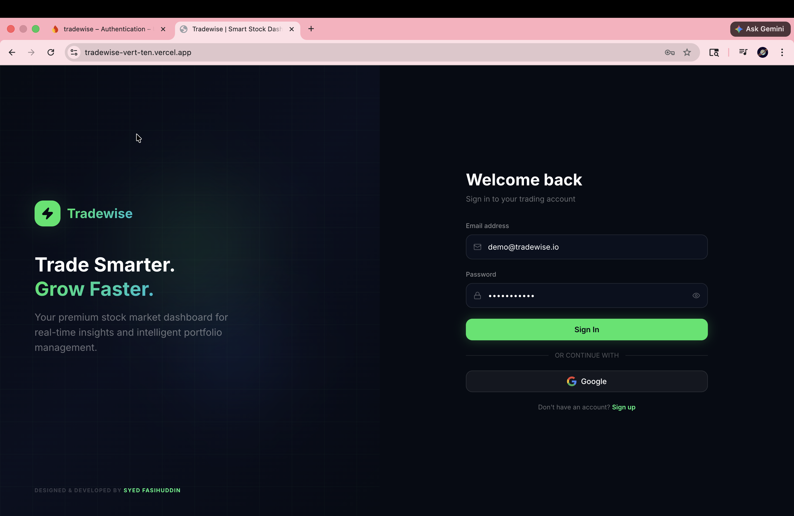

### Register
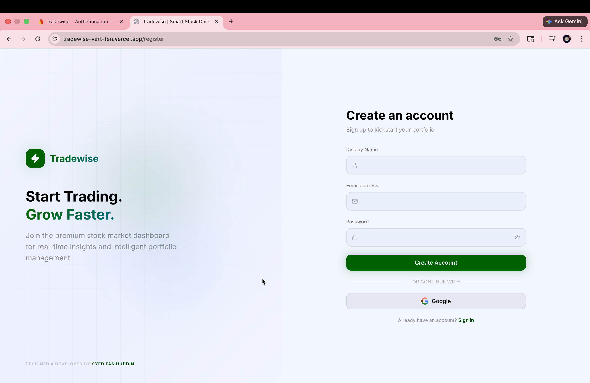

### Dashboard
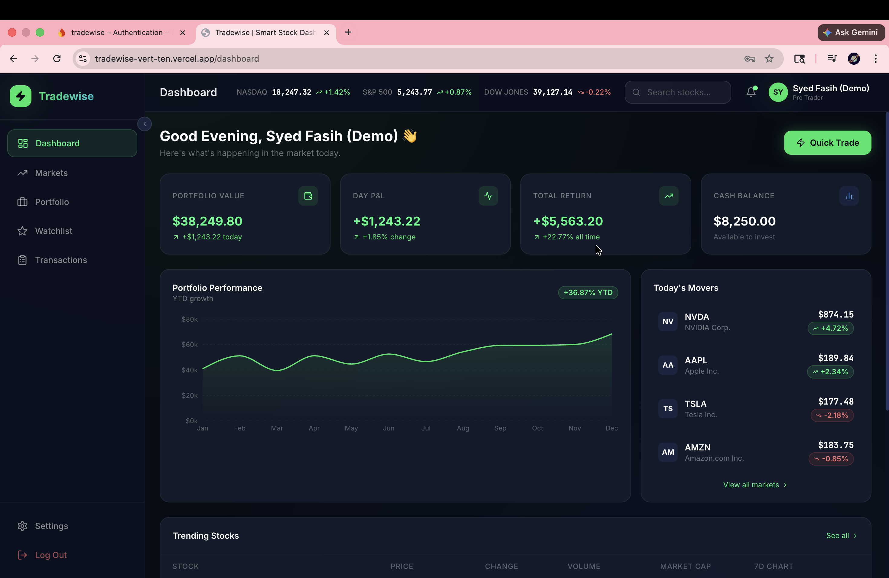

### Markets
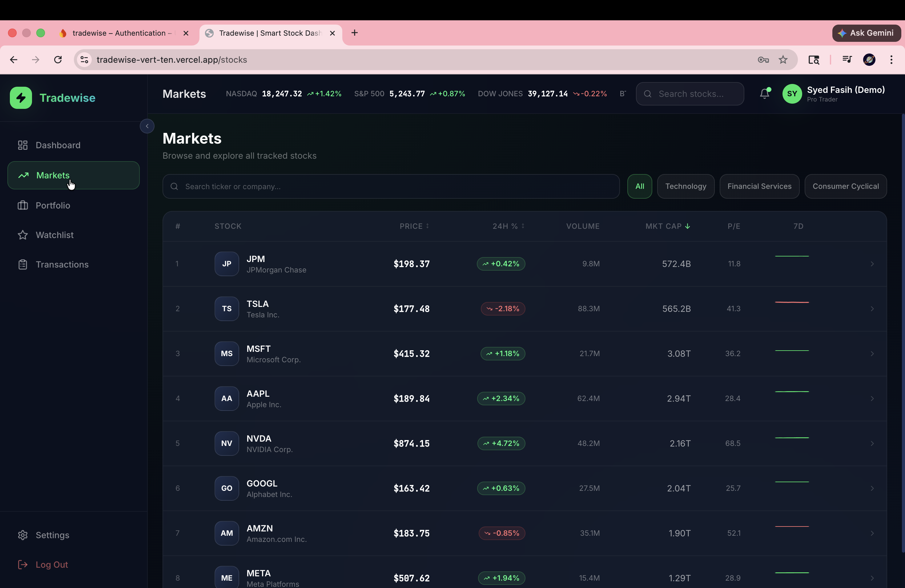

### Portfolio
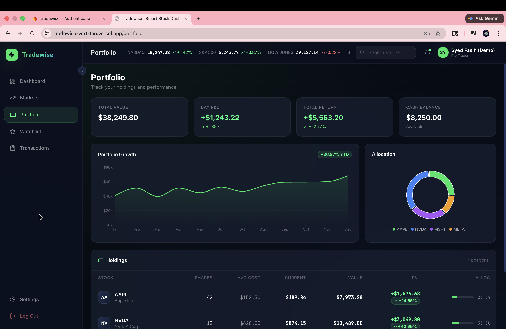

### Watchlist
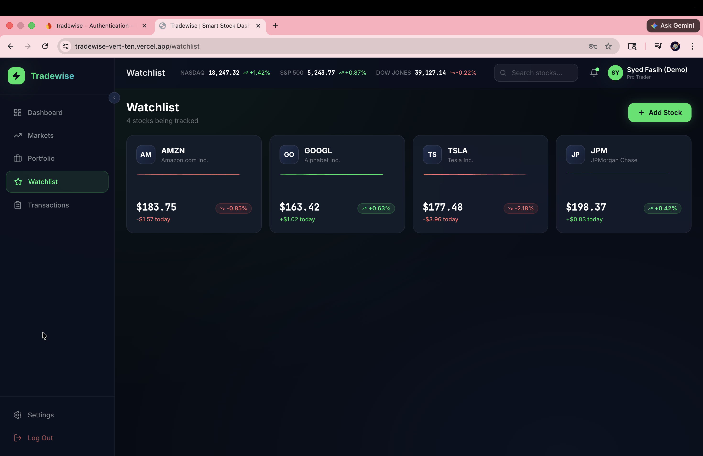

### Transactions
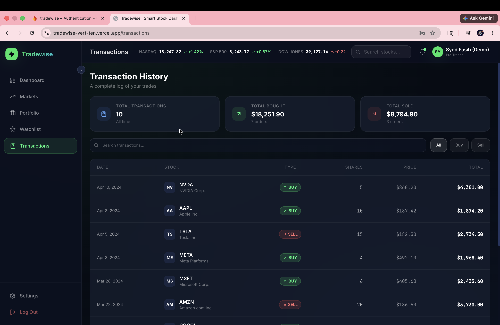

### Settings — Profile
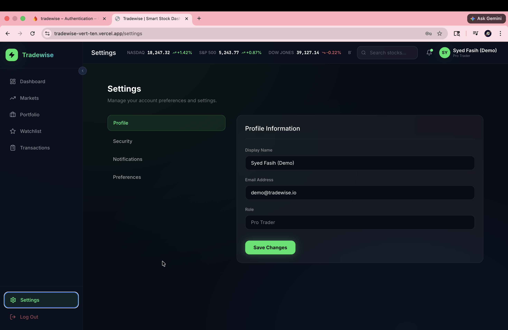

### Settings — Security
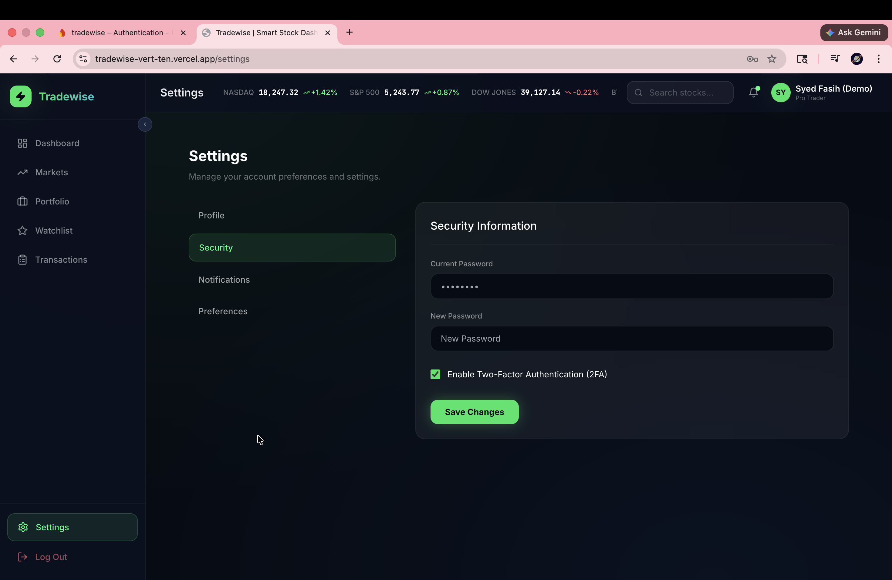

### Settings — Notifications
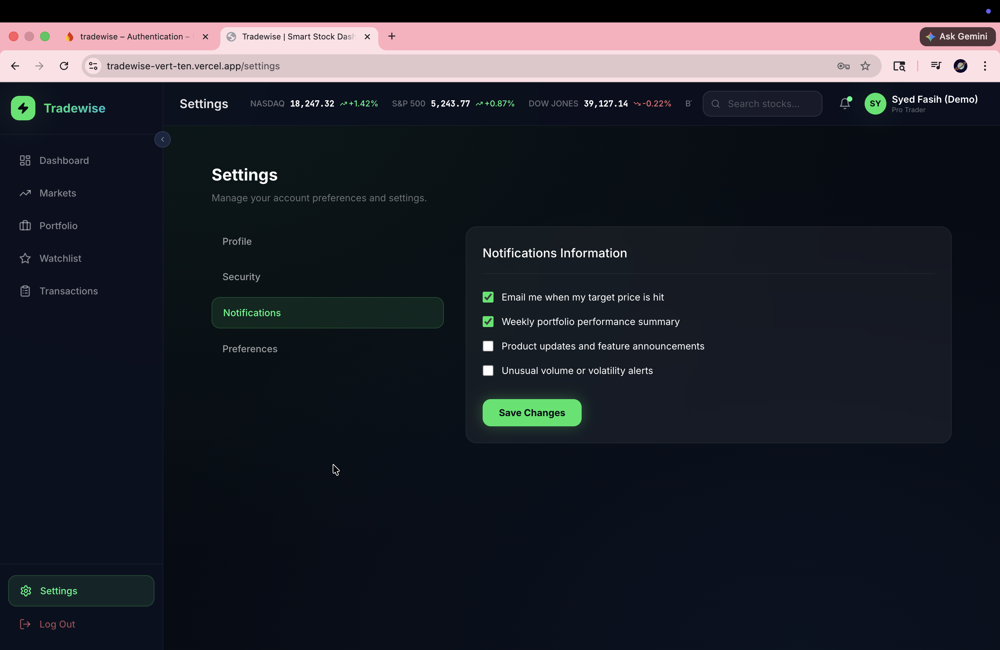

### Settings — Preferences
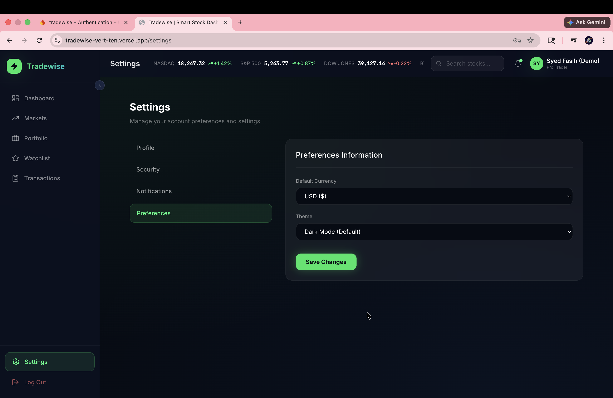

---

## 🚀 Features

- **Dynamic Portfolio Management**: Real-time tracking of cash balances, holdings, and transaction history.
- **Interactive Trading**: Fully functional Buy/Sell engine with automated cost-basis calculation and balance verification.
- **Multi-Auth System**: Secure login via Google SSO or traditional Email/Password, managed by Firebase Auth.
- **Live Markets Overview**: Real-time market indices ticker and individual stock performance metrics.
- **Premium Fintech UI**: A sleek, dark-mode interface powered by Glassmorphism, Framer Motion animations, and Tailwind CSS.
- **Automated Deployment**: Built-in GitHub Actions workflow for continuous integration and deployment.

---

## 🤖 Built with AI

This entire project was built with the assistance of an **AI agent**, showcasing the power of modern AI in full-stack application development. From architecture and design to implementation and deployment, every component was developed with AI guidance.

---

## 🛠️ Tech Stack

- **Frontend**: [React](https://reactjs.org/) + [Vite](https://vitejs.dev/)
- **Styling**: [Tailwind CSS](https://tailwindcss.com/)
- **Animations**: [Framer Motion](https://www.framer.com/motion/)
- **Backend/Auth**: [Firebase](https://firebase.google.com/)
- **Icons**: [Lucide React](https://lucide.dev/)
- **Data Visuals**: [Recharts](https://recharts.org/)
- **Deployment**: [Vercel](https://vercel.com/)

---

## 📦 Getting Started

### Prerequisites

- Node.js (v16+)
- npm or yarn

### Installation

1. Clone the repository:
```bash
   git clone https://github.com/syedfasihuddin24/Tradewise.git
```

2. Install dependencies:
```bash
   npm install
```

3. Create a `.env` file and add your Firebase configuration:
```env
   VITE_FIREBASE_API_KEY=your_key
   VITE_FIREBASE_AUTH_DOMAIN=your_domain
   VITE_FIREBASE_PROJECT_ID=your_project_id
   VITE_FIREBASE_STORAGE_BUCKET=your_bucket
   VITE_FIREBASE_MESSAGING_SENDER_ID=your_sender_id
   VITE_FIREBASE_APP_ID=your_app_id
```

4. Start the development server:
```bash
   npm run dev
```

5. Build for production:
```bash
   npm run build
```

---

Built with ❤️ by [Syed Fasihuddin](https://github.com/syedfasihuddin24)
